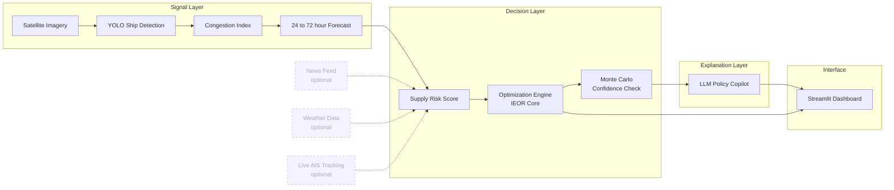

# AegisChain
# AegisChain

**An autonomous decision intelligence platform for India's energy supply chain.**

Built for ET AI Hackathon 2.0, Problem Statement 2 (Energy Supply Chain Resilience) by Team Assets.

When a maritime corridor closes, most systems tell you a disruption happened. AegisChain tells you what to do about it, backed by a real optimization engine, a real trained computer vision model, and a robustness check you can defend under questioning.

---

## The problem

India imports over 90% of the crude oil it consumes, roughly 5.5 million barrels a day, moving through a handful of maritime chokepoints. When one closes, the challenge isn't spotting the disruption. It's answering four questions fast enough for the answer to still matter: how early can we see it coming, what should we actually do, can that recommendation be trusted under pressure, and is it backed by real evidence.

AegisChain answers all four, end to end, in seconds.

---

## Architecture



Every solid arrow above is a real, tested data path. The dashed inputs are the modular extension points, news, weather, and live AIS all plug into the same Risk Signal interface in production without touching the optimization core underneath.

---

## What each module actually does

| Module | File | What it does |
|---|---|---|
| Optimization engine | `optimizer/model.py` | PuLP model allocating crude procurement across suppliers, refineries, and a strategic reserve, under corridor disruption and port congestion constraints |
| Confidence check | `optimizer/confidence.py` | Monte Carlo sensitivity analysis, perturbs cost, risk, and capacity inputs across many trials and reports how often the recommendation holds |
| Decision summary | `optimizer/report.py` | Before and after comparison card, real weighted delay, risk, and cost pulled directly from optimizer output |
| Congestion interface | `cv/congestion.py` | Shared interface for port congestion, supports manual input and live CV inference behind one function signature |
| Ship detection | `cv/infer_congestion.py` | Real YOLOv8 model trained on satellite ship imagery, converts a detected ship count into a congestion multiplier |
| Forecast | `cv/forecast.py` | Trend extrapolation projecting congestion 24, 48, and 72 hours ahead, flags when proactive rerouting is warranted |
| LLM explanation | `dashboard/explain_gemini.py` | One focused prompt narrating the optimizer's before and after decision in plain, executive language |
| Dashboard | `dashboard/app.py` | The live product, wires every module above into one interactive Streamlit interface |

---

## Project structure

```
AegisChain/
├── requirements.txt
├── .env.example
├── optimizer/
│   ├── model.py
│   ├── confidence.py
│   └── report.py
├── cv/
│   ├── congestion.py
│   ├── infer_congestion.py
│   ├── forecast.py
│   ├── weights/
│   │   └── ship_yolov8n.pt
│   └── sample_images/
└── dashboard/
    ├── app.py
    ├── explain_gemini.py
    └── explain.py
```

---

## The live product

Deployed at: **https://aegischain.streamlit.app/**

Upload a real satellite image or trigger a Strait of Hormuz closure from the sidebar and watch the recommendation, cost, risk, and confidence change in real time, live, not a mockup.

---

## Built against the brief

| Evaluation focus | What we built |
|---|---|
| Disruption signal lead time and accuracy | 24 to 72 hour congestion forecast from live CV trend extrapolation |
| Executable procurement alternatives | Named suppliers, exact volumes, exact reserve drawdown days |
| Testable scenario fidelity | Monte Carlo sensitivity, confidence quantified under randomized input noise across many trials |
| Geospatial evidence depth | A trained YOLO model detecting real ships on real satellite imagery |
| End to end response time | Signal to optimized, explained recommendation in seconds, live on screen |

---

## Team Assets

ET AI Hackathon 2.0, Problem Statement 2.
